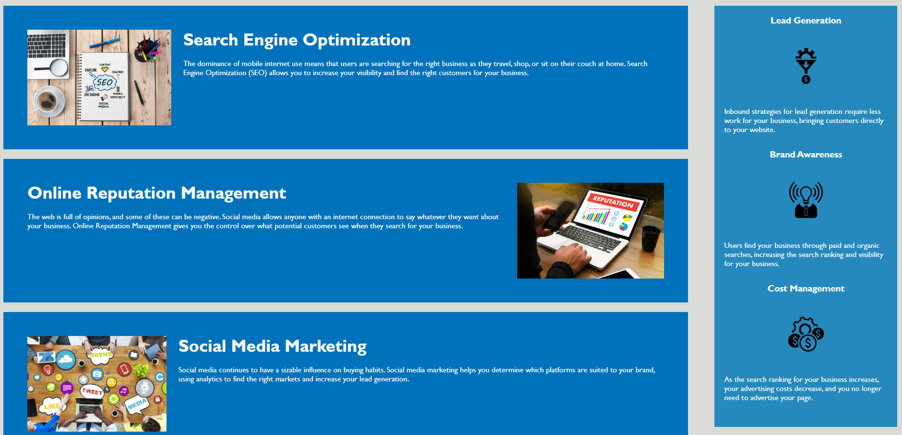

# Code Refactor Challenge 1

## Description 

A code has be given to me for refactoring that follows accessibility standards such that the site is optimised for search engines

## Table of Contents (Optional)

If your README is very long, add a table of contents to make it easy for users to find what they need.

* [Installation](#installation)
* [Usage](#usage)
* [Credits](#credits)
* [License](#license)

## Installation

N/A

## Usage 

Each section on the header is provided with a link which redirect the user to the content below, there is also a side bar which describe all the addtional benefit

Link to application: https://ccc7321.github.io/challenge_1/

## Credits

Thanks Phil for to 1 - 1 tutoring and help on fixing the code.

## License

Please refer to licence in the repo.

---

🏆 The sections listed above are the minimum for a good README, but your project will ultimately determine the content of this document. You might also want to consider adding the following sections.

